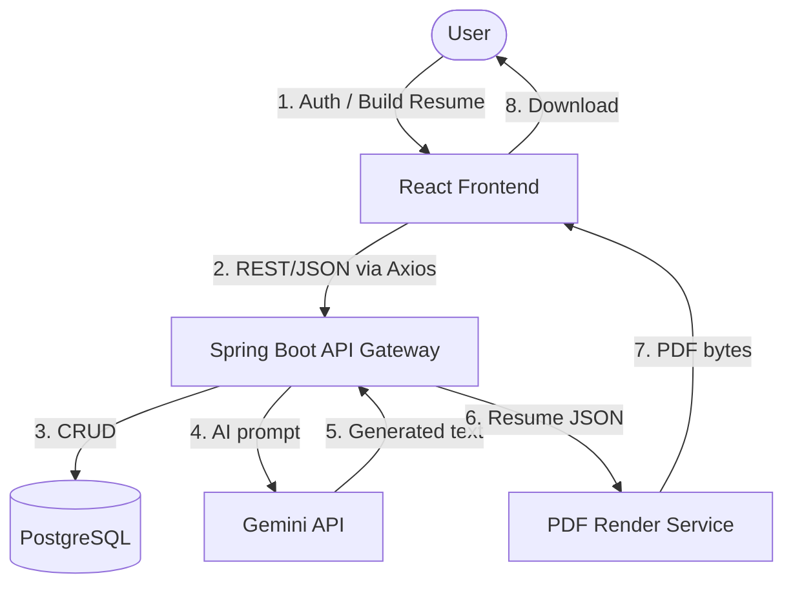

# Software Requirements Specification (SRS)
## Project: SmartCV Builder
**Version:** 1.0 | **Date:** July 2026

---

## 1. System Overview
Full-stack app: React (Vite) SPA frontend, Spring Boot 3.x reactive backend, PostgreSQL persistence, Gemini API for AI content generation, server-side HTML→PDF rendering for export.



## 2. Functional Requirements

### FR-1: Authentication
- FR-1.1: User can register with email + password (BCrypt hashed).
- FR-1.2: User can log in and receive a JWT (access + refresh token pair).
- FR-1.3: All resume endpoints require a valid JWT (Spring Security filter chain).

### FR-2: Resume CRUD
- FR-2.1: User can create a new resume (empty shell, linked to a template ID).
- FR-2.2: User can update any section of a resume (partial PATCH per section, not full-document PUT, to support auto-save).
- FR-2.3: User can list all their resumes (dashboard).
- FR-2.4: User can delete a resume.
- FR-2.5: User can duplicate a resume ("Improve My CV" flow).

### FR-3: Sections (each maps to a DB table, see Data Model)
- Contact, Experience[], Education[], Skills[], Summary, Awards[], Hobbies[], Languages[], Certifications[], Links[], CustomSections[]

### FR-4: AI Content Generation
- FR-4.1: `POST /api/ai/summary` — input: {jobTitle, experienceLevel, keySkills[]} → output: {summary: string}
- FR-4.2: `POST /api/ai/bullet-point` — input: {roughText, roleContext} → output: {bullet: string}
- FR-4.3: `POST /api/ai/skill-suggestions` — input: {jobTitle} → output: {skills: string[]}
- FR-4.4: `POST /api/ai/refine-tone` — input: {text, tone} → output: {refinedText: string}
- FR-4.5: All AI calls go through backend WebClient → Gemini; API key stored server-side only (env var `GEMINI_KEY`, same convention as Mail Agent).

### FR-5: ATS Scoring
- FR-5.1: `POST /api/resume/{id}/score` computes a 0–100 score from:
  - Section completeness (weighted: Experience 30%, Skills 20%, Summary 15%, Education 15%, Contact 10%, Extras 10%)
  - Formatting rule checks (no missing dates, bullet length within range, no empty required fields)
  - Optional AI-assisted keyword-match check against a pasted job description
- FR-5.2: Response includes per-category sub-scores + a list of specific fix suggestions (not just a number).

### FR-6: Templates
- FR-6.1: Backend serves a template registry: `GET /api/templates` → [{id, name, previewUrl, layoutType}]
- FR-6.2: Switching template on the frontend does not alter stored content — layout is a rendering concern only (content/layout separation).

### FR-7: Export
- FR-7.1: `GET /api/resume/{id}/export/pdf` renders the resume server-side (headless Chromium via Playwright/Puppeteer-Java, or Flying Saucer/OpenHTMLtoPDF) using the exact same HTML/CSS template the frontend preview uses, guaranteeing visual parity.
- FR-7.2: Export must complete in < 5s for a standard 1–2 page resume.

### FR-8 (P2, optional): Resume Upload/Parse
- FR-8.1: `POST /api/resume/parse` accepts a PDF/DOCX, extracts text (Apache PDFBox / Apache POI), sends to Gemini with a structured-JSON-output prompt to map into the SmartCV schema, prefills a new resume as a draft for user review/edit (never auto-saved without confirmation).

## 3. Non-Functional Requirements
- NFR-1 (Security): JWT expiry 15 min (access) / 7 days (refresh); passwords BCrypt; Gemini key never sent to client; CORS locked to frontend origin (learn from your Linklytics CORS/WebConfig bug — verify property key names match exactly).
- NFR-2 (Performance): AI endpoints p95 < 5s; CRUD endpoints p95 < 300ms.
- NFR-3 (Reliability): Auto-save must be idempotent and debounced (client-side 2s debounce) to avoid write storms.
- NFR-4 (Portability): Dockerized backend + frontend, deployable to Render/Netlify/Neon Postgres, matching your existing Linklytics deployment pattern.
- NFR-5 (Data integrity): `.env` files must never be committed — enforce `.gitignore` before first commit (lesson from your exposed `.env.prod` incident).
- NFR-6 (Usability): Full builder flow must be usable on a 1366×768 laptop screen without horizontal scroll.

## 4. Data Model (Entities)

```
User (id, email, passwordHash, createdAt)
Resume (id, userId FK, templateId FK, title, accentColor, atsScore, createdAt, updatedAt)
Contact (id, resumeId FK, fullName, jobTitle, email, phone, location)
Experience (id, resumeId FK, company, role, startDate, endDate, bullets: text[], orderIndex)
Education (id, resumeId FK, institution, degree, startDate, endDate, score, orderIndex)
Skill (id, resumeId FK, name, level, category)
Summary (id, resumeId FK, content)
Award (id, resumeId FK, title, issuer, date)
Language (id, resumeId FK, name, proficiency)
Certification (id, resumeId FK, name, issuer, date, url)
Link (id, resumeId FK, label, url)
CustomSection (id, resumeId FK, heading, content, orderIndex)
Template (id, name, previewUrl, layoutType)
```
Relationships: `User 1—N Resume`, `Resume 1—N` each section table (cascade delete on resume removal).

## 5. External Interfaces
- **Gemini API**: `gemini-1.5-flash` (or newer available model) via REST, same WebClient pattern as Mail Agent (`GEMINI_URL`, `GEMINI_KEY` env vars).
- **PDF render engine**: headless browser or HTML-to-PDF library — decision documented in Backend spec.

## 6. Constraints
- Must reuse your existing Java 17 / Spring Boot 3.x / Spring WebFlux stack for consistency across your portfolio.
- Must follow the same environment-variable-only secrets convention as Mail Agent and Linklytics.
- Frontend must visually match the reference screenshots (3-panel builder: left icon rail → template/section/design/spellcheck, center-left form, right live preview).
