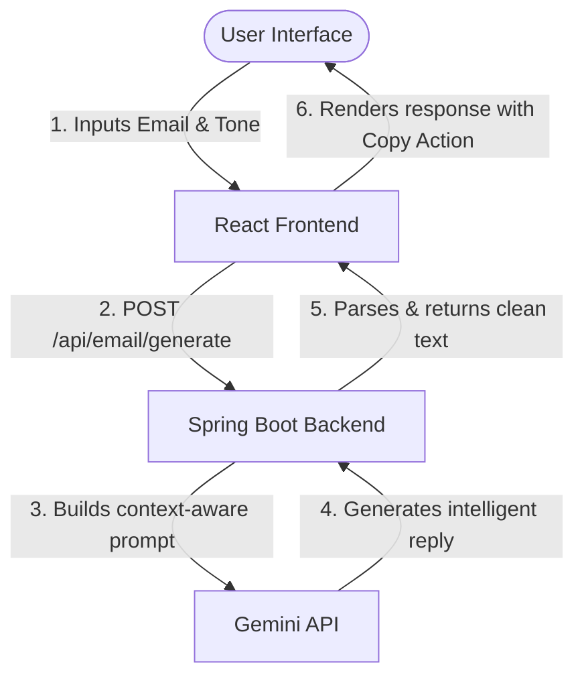

# Spring AI Mail Agent

An intelligent, AI-powered email assistant that automates and optimizes email replies using **Spring AI**, the **Gemini API**, and a modern **React + Material UI (MUI)** frontend.

This repository features a full-stack architecture consisting of:
1. **Frontend**: A sleek React (Vite) single-page application styled with Material UI components.
2. **Backend**: A reactive Spring Boot microservice leveraging WebClient to interact asynchronously with the Gemini LLM.

---

## 🏗️ Architecture Flow



---

## ✨ Features

- ✉️ **Context-Aware Replies**: Generates natural, coherent responses based on the provided original email.
- 🎭 **Tone Calibration**: Customize output tones dynamically (Professional, Casual, Friendly, or default).
- 📋 **Copy to Clipboard**: Quick-copy generated replies with a single click.
- ⚡ **Reactive Networking**: Utilizes Spring Boot's asynchronous `WebClient` for clean, responsive external API consumption.
- 🛡️ **Clean Configuration**: Relies entirely on environment variables to avoid exposing API keys.

---

## 🛠️ Technology Stack

### Backend
- **Java 17**
- **Spring Boot 3.x**
- **Spring WebFlux / WebClient** (for reactive network requests)
- **Lombok** (boilerplate reduction)
- **Jackson Databind** (for JSON parsing)

### Frontend
- **React 18**
- **Vite** (Next-generation build tool)
- **Material UI (MUI) v5**
- **Axios** (HTTP Client)

---

## 🚀 Getting Started

Follow these steps to configure and run the full-stack application locally.

### Prerequisites
- [Java JDK 17 or higher](https://adoptium.net/)
- [Node.js (v18+) & npm](https://nodejs.org/)
- A **Gemini API Key** from [Google AI Studio](https://aistudio.google.com/)

---

### 1. 🟢 Backend Setup (`email-writer-sb`)

1. Navigate to the backend directory:
   ```bash
   cd email-writer-sb
   ```

2. Configure environment variables. Set the Gemini API endpoint and your API key:
   - **Windows (PowerShell)**:
     ```powershell
     $env:GEMINI_URL="https://generativelanguage.googleapis.com/v1beta/models/gemini-1.5-flash:generateContent"
     $env:GEMINI_KEY="your-actual-gemini-api-key-here"
     ```
   - **Linux / macOS**:
     ```bash
     export GEMINI_URL="https://generativelanguage.googleapis.com/v1beta/models/gemini-1.5-flash:generateContent"
     export GEMINI_KEY="your-actual-gemini-api-key-here"
     ```

3. Run the Spring Boot application using Maven:
   ```bash
   ./mvnw spring-boot:run
   ```
   *The server will start on **`http://localhost:8080`** by default.*

---

### 2. 🔵 Frontend Setup (`email-writer frontend`)

1. Navigate to the frontend directory:
   ```bash
   cd "email-writer frontend"
   ```

2. Install dependencies:
   ```bash
   npm install
   ```

3. Start the development server:
   ```bash
   npm run dev
   ```
   *The frontend will be available at **`http://localhost:5173`**.*

---

## 🔌 API Documentation

### **Generate Email Reply**
Exposes a single POST endpoint to receive email content and desired tone.

- **URL**: `/api/email/generate`
- **Method**: `POST`
- **Content-Type**: `application/json`

#### **Request Body**
```json
{
  "emailContent": "Hi, are we still on for our project presentation meeting tomorrow at 10 AM?",
  "tone": "professional"
}
```

#### **Response (Text/Plain)**
```text
Yes, we are still on for the project presentation meeting tomorrow at 10 AM. I have prepared the slides and look forward to our discussion.
```

---

## 🤝 Contributing

Contributions, issues, and feature requests are welcome! Feel free to check the issues page.
